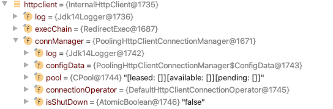

# Apache Http Client を使用したときに発生する too many open files エラーについて

## はじめに

## CloseableHttpClient のclose処理

CloseableHttpClientは名前が示すとおり, closeメソッドを呼んでリソースを解放することができる(というより, しなくてはならない)。
しかし, [ApacheのHttpClient Tutorial](http://hc.apache.org/httpcomponents-client-4.5.x/tutorial/html/fundamentals.html#d5e199)には下記の記載があり,
このサンプルではCloseableHttpClient#closeを呼んでいないため, そのまま実装すると, close漏れによるエラー(Too many open files)が発生する。
このトラブルに遭遇している人は割と多いと思われる(Googleで"apache http client too many open files"で調べるとわかる)

``` java
CloseableHttpClient httpclient = HttpClients.createDefault();
HttpGet httpget = new HttpGet("http://localhost/json");

ResponseHandler<MyJsonObject> rh = new ResponseHandler<MyJsonObject>() {

    @Override
    public JsonObject handleResponse(
            final HttpResponse response) throws IOException {
        StatusLine statusLine = response.getStatusLine();
        HttpEntity entity = response.getEntity();
        if (statusLine.getStatusCode() >= 300) {
            throw new HttpResponseException(
                    statusLine.getStatusCode(),
                    statusLine.getReasonPhrase());
        }
        if (entity == null) {
            throw new ClientProtocolException("Response contains no content");
        }
        Gson gson = new GsonBuilder().create();
        ContentType contentType = ContentType.getOrDefault(entity);
        Charset charset = contentType.getCharset();
        Reader reader = new InputStreamReader(entity.getContent(), charset);
        return gson.fromJson(reader, MyJsonObject.class);
    }
};
MyJsonObject myjson = client.execute(httpget, rh);
```

なお, CloseableHttpClientは[AutoClosable](https://docs.oracle.com/javase/jp/8/docs/api/java/lang/AutoCloseable.html)を実装しているため, 
明示的にcloseするよりは, try-with-resources文を使って自動的にcloseするほうが良い。

上記の例であれば, 下記のように実装する。

``` java
try (CloseableHttpClient httpclient = HttpClients.createDefault()) {
  HttpGet httpget = new HttpGet("http://localhost/json");

  ResponseHandler<MyJsonObject> rh = new ResponseHandler<MyJsonObject>() {

      @Override
      public JsonObject handleResponse(
          final HttpResponse response) throws IOException {
        StatusLine statusLine = response.getStatusLine();
        HttpEntity entity = response.getEntity();
        if (statusLine.getStatusCode() >= 300) {
          throw new HttpResponseException(
              statusLine.getStatusCode(),
              statusLine.getReasonPhrase());
        }
        if (entity == null) {
          throw new ClientProtocolException("Response contains no content");
        }
        Gson gson = new GsonBuilder().create();
        ContentType contentType = ContentType.getOrDefault(entity);
        Charset charset = contentType.getCharset();
        Reader reader = new InputStreamReader(entity.getContent(), charset);
        return gson.fromJson(reader, MyJsonObject.class);
      }
    };
  MyJsonObject myjson = client.execute(httpget, rh);
}
```

普通に考えれば CloseableHttpClient を生成して, closeを発行せず, 上記の処理を繰り返せば, プロセスごとにオープンできるファイル数の上限に達した時点でエラーになると思われるが, 実際はそうならない。これは, CloseableHttpClient生成時に同じく生成される PoolingHttpClientConnectionManager にfinalizeメソッドが実装されているためと思われる。

``` java
// org.apache.http.impl.conn.PoolingHttpClientConnectionManager

@Override
    protected void finalize() throws Throwable {
        try {
            shutdown();
        } finally {
            super.finalize();
        }
    }
```

CloseableHttpClient を生成し, いずれのスレッドからも参照していない場合, GCが発生した時点で, 上記の PoolingHttpClientConnectionManager とともに解放可能となる(実際は, finalizeメソッドを実装したオブジェクトが解放されるまでには, 
いくつかの状態遷移が伴う。これについては, [(*1)](https://www.fujitsu.com/jp/documents/products/software/resources/technical/interstage/apserver/guide/Finalizer-GC.pdf)を参照)。解放可能になったオブジェクトはJVMのFinalizerスレッドが任意のタイミングでfinalizerメソッド呼び出し, その後, そのオブジェクト自身がGCによって解放される。




## GC と finalizer の関係について

上記の検証するため, 繰り返し CloseableHttpClient を生成し, GCとfinalizerとオープン済みSocketの数を計測した。

* [検証プログラムのソース](./console-app/src/main/java/echoview/sample/ConsoleAppMain.java)


### ヒープメモリに256Mを指定した場合

``` shell
  java -Xms256M -Xmx256M -cp "target/http-client-console-app-1.0-SNAPSHOT.jar:target/dependency/*" -verbose:gc -XX:+PrintGCDetails -XX:+PrintGCDateStamps echoview.sample.ConsoleAppMain > console-app-256m.log 2>&1
```


* ヒープメモリの指定を多くした場合
* finalizeメソッドがdepricatedに
* finalizerスレッドの実行の様子

## 検証環境

## 参考資料


 Socketの使用数が増え続けるのは, CloseableHttpClientのclose発行漏れが原因の一つ
   (<- 使用しているsocketの接続先を確認することで検証できる(増加した分の確認で更に確証が得られる)。
    ファイルクローズ漏れの可能性もあるが, 現時点では確認されていない)
   このバグを修正すれば, socket は使用後すぐに解放されるため, 同時に使用する
   socket数の数は, 下記の様になる(予想)。

   G(外部サーバーに接続している数≒同時受付リクエスト数) + I(内部で通信している数=リクエストバッチ) + D(DBのコネクションの数)


2. 1.でリークしているsocketの数が上下する理由

   JavaのSocketクラスを直接使用した場合は, closeしなければ, socketを使用した分だけ
   ファイルオープン数は増加し, 数千回作成した後, too many open files エラーとなる(未確認)。
   (減ったりはしないはず(未確認))

   今回 Socketを使用せず, Apache の CloseableHttpClient クラスを使用している(Socketは内部で使用している)。
   CloseableHttpClientが保持する PoolingHttpClientConnectionManager は
   finalize メソッドをセーフティネット的に実装しているため, GCのタイミングで finalize メソッドが呼ばれ,
   未closeのsocketをcloseしてくれる(<= これが発覚を遅らせた)

   finalize メソッドはGC実行タイミングと密接な関係があり, GCが起きなければfinalizeメソッドが呼ばれない。
   (ここで注意!!)GCが起きても finalize メソッドが常に呼ばれるわけではない。
   (補足)finalizeメソッドはGCとは別のファイナライザースレッドで実行される。何らかの理由でこのスレッドが実行されないこともある。
   また, GCが頻発すると, STW(Stop the world)が発生し, 全処理が停止されるので, GCの頻発がfinalizerの実行を妨げることもある(可能性の一つ)
   (補足2) Old(Tenured)領域に移動させられたオブジェクトは, Major GC(Full GC)が発生しないとGCの対象にならないので, 更にfinalizeメソッドの実行が遅れる。
   一時オブジェクトであれば, Minor GCですぐにガベージコレクトの対象になるので, finalizerは早めに実行される。
   (補足3) JVMでは, finalizerの実行タイミングについての規定はない。呼ばれないこともありうる(Javaの仕様)。

   そのため, オープン中の socket の数は, 本来リクエストのたびに解放されていないため単調増加するが,
   GCのトリガーとして実行される finalizer により, 部分的に  close されているため減る
   (念の為, GCが発生する=finalizerが実行されるのはない。GCを契機に finalizer が起動可能となる。両者は別のもの)
   
   finalizerの実行が何らかの理由でなされないと, socketの数は増え続けることになる。

   finalizerの実行タイミングを知るためには, 任意のオブジェクトで finalize メソッドをオーバーライドし,
   finalizeメソッドでログ出力する等を実装する。
   このオブジェクトを new すれば(ただし,GCの対象になるように参照しないでおく), finalizeのタイミングが
   わかる(かもしれない)


   (重要)
   ヒープメモリ(NEW, OLD)を多く確保すると, その分GCの頻度が減り, finalizerも実行の契機が少なくなるので,
   socketの上限に達しやすくなる。


(参考資料)
* ファイナライザを理解する(Fujitsu)
  https://www.fujitsu.com/jp/documents/products/software/resources/technical/interstage/apserver/guide/Finalizer-GC.pdf

* JavaのGC頻度に惑わされた年末年始の苦いメモリ (1/3)
  https://www.atmarkit.co.jp/ait/articles/0712/27/news081.html
